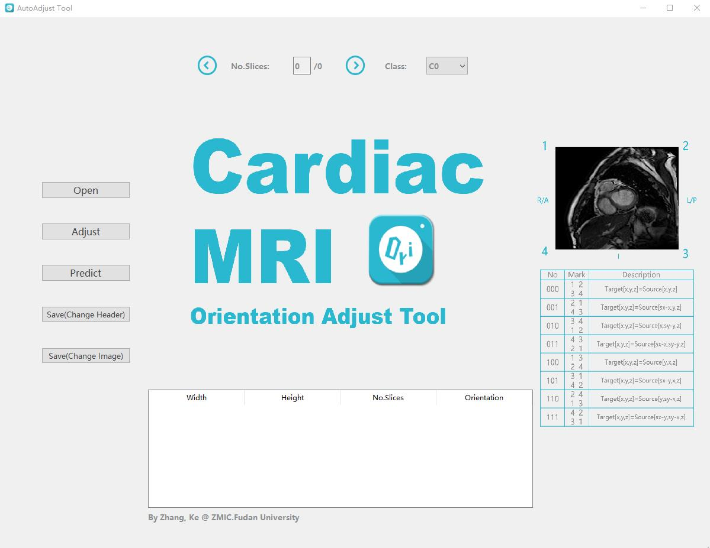

## Cardiac MRI Orientation Adjust Tool

### Task Description:
Due to different data sources and scanning habits, the orientation of different cardiac magnetic resonance images may be different, and the orientation matrix corresponding to the image itself may not correspond correctly. This may cause problems in tasks such as image segmentation or registration.  

Taking a 2D image as an example, we set the orientation of an image as the initial image, and set the four corners of the image to (1, 2, 3, 4),Then the orientation of the 2D MR image may have the following 8 variations.
| No | Operation | Representation | Description|
|:----:|:----:|:----:|:----:|
| 000 | initial state |(1,2,3,4)|Target[x,y,z]=Source[x,y,z]|
| 001 | horizontal flip |(2,1,4,3)|Target[x,y,z]=Source[sx-x,y,z]|
| 010 | vertical flip |(3,4,1,2)|Target[x,y,z]=Source[x,sy-y,z]|
| 011 | Rotate 180° clockwise |(4,3,2,1)|Target[x,y,z]=Source[sx-x,sy-y,z]|
| 100 |Flip along the upper left-lower right corner |(1,3,2,4)|Target[x,y,z]=Source[y,x,z]|
| 101 |Rotate 90° clockwise|(3,1,4,2)|Target[x,y,z]=Source[sx-y,x,z]|
| 110 |Rotate 270° clockwise|(2,4,1,3)|Target[x,y,z]=Source[y,sy-x,z]|
| 110 |Flip along the bottom left-top right corner|(4,2,3,1)|Target[x,y,z]=Source[sx-y,sy-x,z]|


We designed the DNN network, input the heart magnetic resonance image of the scrambled orientation, and output the number corresponding to the magnetic resonance image (classification problem, divided into 8 mutually exclusive categories). Finally, we embedded the network into the UI interface and command line tools to form the Cardiac MRI Orientation Adjust Tool. The model is trained and tested on the [MSCMRseg](https://zmiclab.github.io/zxh/0/mscmrseg19/data.html) dataset.

### UI interface





### Command Line Tool

To test folder batch processing, just type:
```
python command.py folder_path -f   
```
To test single file, type: 
```
python command.py file_path  
```

```
usage: command.py file_path
[-h] 
[-k [KEEP_HEADER]] 
[-f [BATCH_PROCESS]]
[-o [SAVE_PATH]] 
[-c [{C0,T2,LGE}]]
```

file_path: the input file path (Required)  

KEEP_HEADER[-k]:  don't ajust the header orientation(Optional)  

BATCH_PROCESS[-f]:  process all files by search the folder(*.mha, *.nii,*.nii.gz are supported) (Optional)  

SAVE_PATH[-o]: specify the save path of adjusted file(Optional)  

TYPE[-c]: specify the type of adjusted file(Optional, [C0,T2,LGE are supported])  

### Training
The classification is trained with the follow command:
```
python train.py
```
Thanks Tao Hong for the update of train.py!

### Citation
Please cite these two works, based on which we trained our DNN models, when you use the tool:  
[1] Xiahai Zhuang: Multivariate mixture model for myocardial segmentation combining multi-source images. IEEE Transactions on Pattern Analysis and Machine Intelligence (T PAMI), vol. 41, no. 12, 2933-2946, Dec 2019.   

[2] Xiahai Zhuang: Multivariate mixture model for cardiac segmentation from multi-sequence MRI.  International Conference on Medical Image Computing and Computer-Assisted Intervention, pp.581-588, 2016. 

[3] Zhang, K., Zhuang, X. (2020). Recognition and Standardization of Cardiac MRI Orientation via Multi-tasking Learning and Deep Neural Networks. In: Zhuang, X., Li, L. (eds) Myocardial Pathology Segmentation Combining Multi-Sequence Cardiac Magnetic Resonance Images. MyoPS 2020. Lecture Notes in Computer Science(), vol 12554. Springer, Cham. https://doi.org/10.1007/978-3-030-65651-5_16
